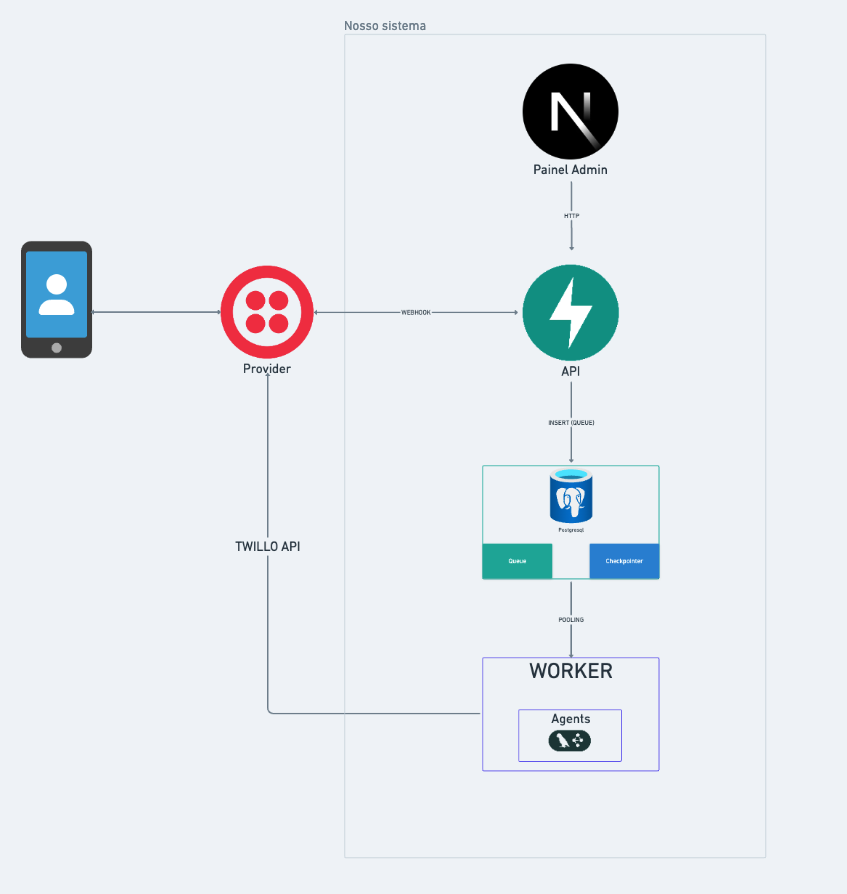

# WhatsApp LangChain

Template educacional e production-ready para criar agentes de IA no WhatsApp usando LangGraph.

## O que é?

Um sistema completo que conecta agentes de IA ao WhatsApp. Você define o comportamento do agente usando LangGraph, e a infraestrutura cuida do resto: receber mensagens, processar com IA, e responder automaticamente.

## Arquitetura



```
Usuário (WhatsApp)
       │
       ▼
┌─────────────┐     ┌──────────────┐     ┌─────────────┐
│   Twilio     │────▶│     API      │────▶│ PostgreSQL  │
│  (Provider)  │     │  (FastAPI)   │     │  (Fila +    │
└─────────────┘     └──────────────┘     │ Checkpointer)│
                                          └──────┬───────┘
                                                 │
┌─────────────┐     ┌──────────────┐             │
│   Twilio     │◀───│   Worker     │◀────────────┘
│  (Resposta)  │    │  (LangGraph) │
└─────────────┘     └──────────────┘

┌──────────────┐
│  Admin Panel │───▶ API (métricas, conversas, fila)
│  (Next.js)   │
└──────────────┘
```

**Por que 3 serviços?**

- **API** recebe a mensagem e enfileira. Responde em milissegundos.
- **Worker** processa com IA. Pode demorar segundos — sem bloquear a API.
- **Frontend** monitora tudo via Admin Panel.

Isso garante que nenhuma mensagem é perdida, mesmo sob alta carga.

## Quick Start

### 1. Instale o uv (gerenciador de pacotes)

```bash
# Windows (PowerShell)
irm https://astral.sh/uv/install.ps1 | iex

# Mac/Linux
curl -LsSf https://astral.sh/uv/install.sh | sh

# Ou via pip (qualquer OS)
pip install uv
```

### 2. Configure o projeto

```bash
git clone <repo-url>
cd whatsapp-langchain

# Cria ambiente virtual e instala dependências
uv venv
uv pip install -e ".[dev]"

# Configure as variáveis de ambiente
cp .env.example .env   # Edite com suas chaves
```

### 3. Desenvolva o agente

```bash
uv run langgraph dev   # Abre o LangGraph Studio
```

### 4. Rode a infraestrutura (Fase 2+)

```bash
# API + Worker + DB (Docker)
docker compose up -d

# Admin Panel
cd frontend && npm run dev
```

> **Atalhos (Mac/Linux/WSL):** Se preferir, use `make setup`, `make dev`, etc. Veja a seção Comandos.

## Estrutura do Projeto

```
whatsapp-langchain/
├── src/whatsapp_langchain/
│   ├── agents/                # Agentes de IA
│   │   ├── catalog/           # Um diretório por agente
│   │   │   └── assistant/     # Agente padrão
│   │   └── middleware/        # Trim, Summarize e Semantic Memory
│   ├── server/                # API (FastAPI)
│   │   ├── routes/            # Endpoints
│   │   └── services/          # Queue, Rate Limit
│   ├── worker/                # Processamento (LangGraph)
│   └── shared/                # Config, DB, Models, Logs
├── frontend/                  # Admin Panel (Next.js)
├── stress/                    # Testes de stress (Locust)
├── langgraph.json             # Registry de agentes
├── docker-compose.yml         # Dev local
├── Makefile                   # Comandos úteis
└── docs/                      # Documentação
```

## Documentação

| Documento | Descrição |
|-----------|-----------|
| [Primeiros Passos](docs/GETTING_STARTED.md) | Como rodar o projeto |
| [Arquitetura](docs/ARCHITECTURE.md) | Como o sistema funciona |
| [Criando Agentes](docs/ADDING_AGENTS.md) | Como criar novos agentes |
| [Deploy](docs/DEPLOY.md) | Como colocar em produção |

## Pré-requisitos

- Python 3.11+
- [uv](https://docs.astral.sh/uv/) (gerenciador de pacotes — funciona no Windows, Mac e Linux)
- Docker e Docker Compose (para Fase 2+)
- Node.js 20+ (para o Admin Panel)
- Conta [OpenRouter](https://openrouter.ai/) (LLM)
- Conta [Twilio](https://www.twilio.com/) com número WhatsApp (para produção)

## Comandos

### Comandos diretos (qualquer OS)

```bash
uv venv                      # Cria ambiente virtual
uv pip install -e ".[dev]"   # Instala dependências
uv run langgraph dev         # LangGraph Studio
uv run ruff check .          # Lint
uv run ruff format .         # Formata código
uv run pyright src/          # Type check
uv run pytest                # Testes
```

### Atalhos Makefile (Mac/Linux/WSL)

```bash
make setup          # Cria .venv e instala dependências
make dev            # LangGraph Studio (desenvolvimento de agentes)
make lint           # Ruff check
make format         # Ruff format
make check          # Lint + type check
make clean          # Remove __pycache__
```

## Licença

[TOPHAWKS Community License](LICENSE) — Uso restrito a membros da comunidade [TOPHAWKS](https://www.rhawk.pro/comunidade).
